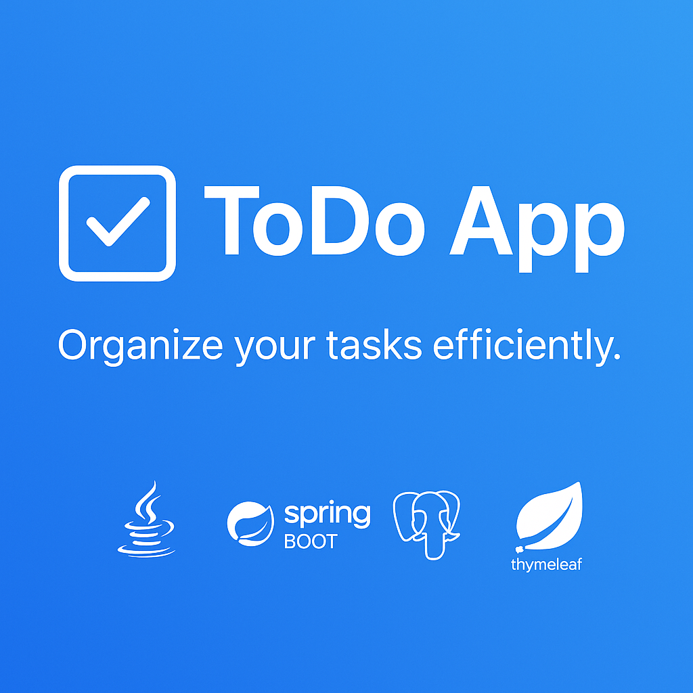

  

# 📝 ToDo Application

A simple task management web application built with **Spring Boot**, **Thymeleaf**, and **Bootstrap**.  
Users can create, view, and delete personal tasks.

---

## 🚀 Features

- View all tasks in a styled list
- Add new tasks via a web form
- Mark tasks as completed
- Delete tasks
- Responsive UI with Bootstrap 5

---
💡 Styling is handled via Bootstrap 5 (CDN). No local CSS files required.

## 📦 Tech Stack

- Java 17+
- Spring Boot
- Spring MVC
- Thymeleaf
- - **Spring Data JPA**
- Bootstrap 5 (CDN)
- Maven

## 👤 Author

- Kateryna Rakova — [@KaterynaRakova]https://github.com/KaterynaRakova)